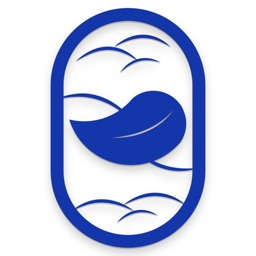
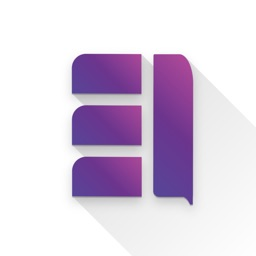
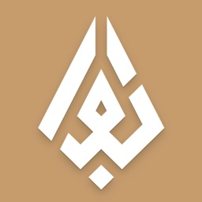
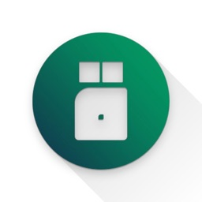

  <picture>
    <source media="(max-width: 680px)" srcset="assets/header-mobile.svg" />
    
  </picture>

  
  
  
  <picture></picture>
   
  
  

  <picture>
    <source media="(max-width: 680px)" srcset="assets/stats-mobile.svg" />
    
  </picture>

<picture></picture>

Flutter engineer and team lead. I work where Flutter stops and the platform begins — network extensions, tunnel providers, native Swift and Kotlin modules — and I own releases end to end, from signing through App Store &amp; Play Store review.

### Live in the stores

| | | | |
|---|---|---|---|
| <picture></picture> | **Lounge Clinic** | Telemedicine with real-time chat, voice and video. Sole developer, Medical category, 16+ |  |
| <picture></picture> | **TeachWise Family** | Parent–child learning platform, Arabic RTL. Sole developer |   |
| <picture></picture> | **الـعـراب** — Al-Arrab | Real-estate brokerage platform: agent client management and sales pipeline. Arabic RTL |   |
| <picture></picture> | **Rqeab** — رقيب | DNS content filtering and parental control, built natively on `NetworkExtension` and `VpnService` |  |

**Also shipped, clients under NDA** — [KUTHB](https://play.google.com/store/apps/details?id=com.trujenaapp.kuthb) · [Elegance Pluss](https://play.google.com/store/apps/details?id=com.trujenaapp.elegancepluss) · Multi-vendor e-commerce platform · A multi-tenant white-label platform behind 500+ client builds across both stores

<picture></picture>

### Stack

  <picture></picture>
  <picture></picture>
  <picture></picture>
  <picture></picture>
  <picture></picture>
  <picture></picture>
  <picture></picture>
  <picture></picture>

**Native** — platform channels, `NetworkExtension`, `VpnService`, tunnel providers, background execution, Swift and Kotlin modules, deep linking

**Architecture** — Clean Architecture, MVVM, SOLID, BLoC, Cubit, `get_it`, `injectable`, `freezed`, multi-tenant white-label

**Real-time** — ZegoCloud, WebRTC, WebSocket, call session state, background call notifications, reconnection on unstable networks

**Integrations** — OneSignal, Firebase Cloud Messaging, APNs, MyFatoorah, Paymob, StoreKit in-app purchases with receipt validation, AdMob

**Data** — Dio with token refresh, REST, SQLite, Hive, `flutter_secure_storage`, offline caching, Firestore

**Testing** — unit, widget and integration tests

**Release** — App Store Connect, Play Console, TestFlight, CI pipelines for build and signing, entitlements, flavors, `--dart-define`, staged rollout, review and rejection remediation

**Also** — Crashlytics, DevTools profiling, `--obfuscate`, Arabic RTL and accessibility, leading a team of 3

<picture></picture>

### Why the repositories are private

Client work under NDA. The apps above are the public half — installable and shipped by me. Architecture and technical detail are things I'm happy to walk through in a call.

If it has to work offline, in Arabic, on an unreliable network, and still pass review — I have shipped that.

   
  <picture></picture>
    
  Don't hesitate to reach out — you are most welcome.
    
  <a href="mailto:Mahmoud.khalil.dev@gmail.com"><b>Mahmoud.khalil.dev@gmail.com</b></a>
  &nbsp;·&nbsp;
  <a href="https://www.linkedin.com/in/mahmoud-khalil-3683b6215"><b>LinkedIn</b></a>

